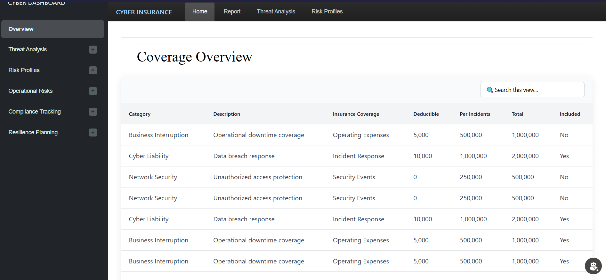

## Cyber Insurance & Security Threat Monitoring Dashboard

This project is a **Cyber Insurance and Cyber Security Threat Monitoring Dashboard** designed to provide a centralized view of security threats, risk status, and insurance coverage insights. The dashboard enables organizations to monitor cyber attacks, analyze threat trends, and evaluate insurance coverage related to cybersecurity incidents.
## Tech Stack

- **Power Pages** – Frontend portal for building secure and responsive dashboards

- **Power BI** – Data visualization and analytical reporting

- **Power Platform (Dataverse)** – Backend data storage and management

- **JavaScript** – Client-side logic and interactivity

- **HTML & CSS** – Custom UI layout and styling

- **Power Platform Security** – Role-based access and data protection
### Key Features

* **Threat Monitoring Overview**
   

  * Displays total attack counts, pass/fail ratios, and overall security status.
  * Visual KPIs for quick assessment of cyber risk posture.
  * Source country filtering to analyze threats based on geographic origin.

* **Threat Analysis & Trends**

  * Daily attack trend visualization to identify spikes and patterns in cyber activity.
  * Breakdown of threat types with status indicators such as *Detected*, *Mitigated*, and *Ongoing*.
  * Donut and bar charts for intuitive analysis of attack outcomes.

* **Risk & Operational Insights**

  * Dedicated sections for risk profiles, operational risks, compliance tracking, and resilience planning.
  * Helps security teams and decision-makers understand exposure and response effectiveness.

* **Cyber Insurance Coverage Overview**
   

  * Detailed table view of insurance categories such as:

    * Business Interruption
    * Cyber Liability
    * Network Security
  * Displays coverage descriptions, deductibles, per-incident limits, total coverage, and inclusion status.
  * Searchable and structured layout for quick policy evaluation.

* **User-Friendly Navigation**

  * Sidebar navigation for seamless access to different modules.
  * Clean, modern UI optimized for dashboards and reporting.

### Use Case

This dashboard is ideal for:

* Cybersecurity analysts monitoring threat activity
* Risk and compliance teams assessing exposure
* Organizations evaluating cyber insurance coverage alongside real-time threat data
* Decision-makers seeking data-driven insights for cyber resilience planning

